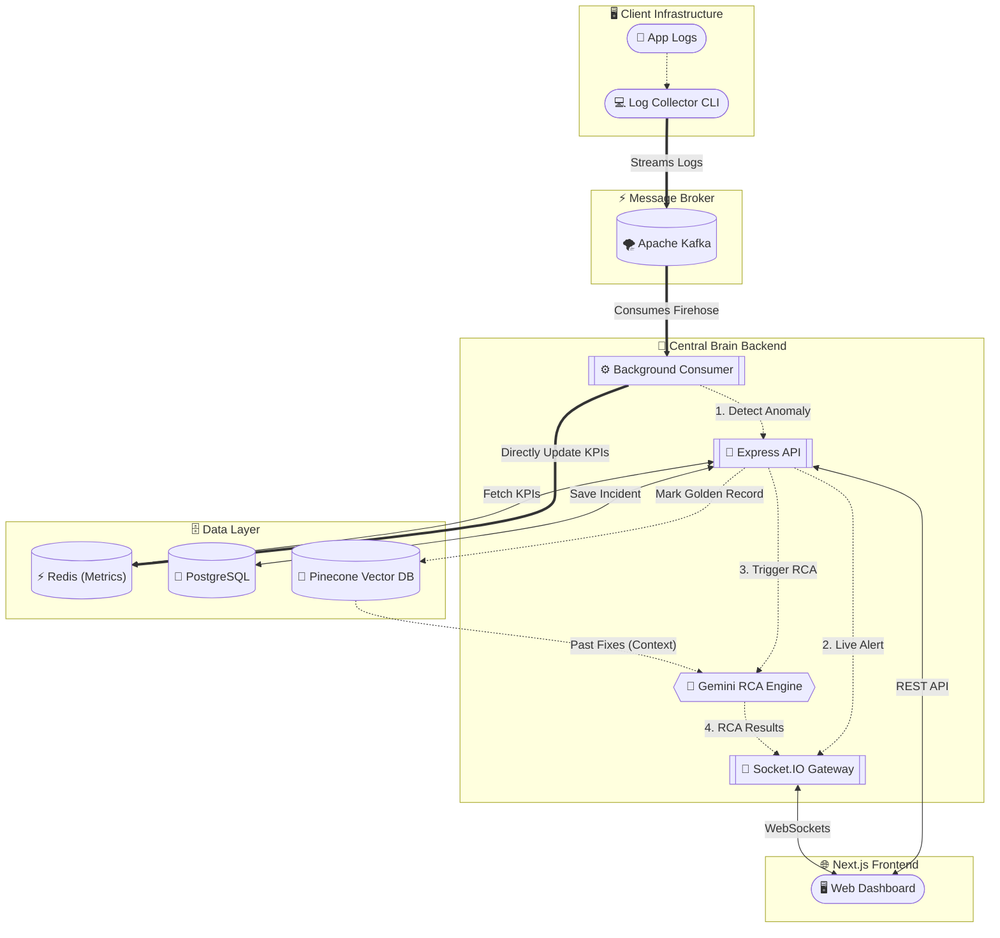

<div align="center">
  
  <h1>AI-Ops Sentinel</h1>
  <p><strong>Intelligent, Multi-Tenant Root Cause Analysis & Real-Time Log Monitoring</strong></p>
  
  <p>
    
    
    
    
    
    
    
  </p>
</div>

---

**AI-Ops Sentinel** is a powerful platform built for Site Reliability Engineers (SREs) and DevOps teams. It automatically ingests server logs via Apache Kafka, uses Google Gemini AI coupled with a Pinecone Vector Database (RAG) to instantly identify the root cause of crashes, and streams the analysis live to an isolated, multi-tenant Next.js dashboard using WebSockets.

## ✨ Core Features

* 🚀 **Real-Time Log Ingestion**: Uses Apache Kafka to handle massive throughput of server logs securely.
* 🤖 **AI Root Cause Analysis**: Leverages Google Gemini 2.5 Flash to automatically detect anomalies and generate human-readable solutions.
* 📚 **RAG (Retrieval-Augmented Generation)**: Queries Pinecone Vector DB to find "Golden Records" (historical fixes) to solve new problems based on past company knowledge.
* 🔒 **Multi-Tenant Architecture**: Robust tenant isolation using JWT-authenticated WebSockets and Redis key-spacing. Customer A can never see Customer B's logs.
* ⚡ **Live WebSocket Dashboard**: React Context-driven Socket.IO integration for instant incident alerts and live KPI graphs without page refreshes.

---

## 🏗️ Architecture



---

## 🚀 Quick Start (Local Development)

To run the entire platform locally, you will need **Docker Desktop**, **Node.js v20+**, and free API keys for **Google AI Studio** and **Pinecone**.

### 1. Start Infrastructure
We use Docker Compose to spin up Zookeeper, Kafka, Redis, and PostgreSQL.
```bash
cd aiops-sentinel-backend
docker compose up -d
```
*Wait ~30 seconds for Kafka to become fully healthy.*

### 2. Configure & Start Backend (`central-brain`)
The backend orchestrates the AI, WebSockets, and database.
```bash
cd services/central-brain
cp .env.example .env
npm install
```
Edit `.env` and add your `GEMINI_API_KEY` and `PINECONE_API_KEY`. (If you don't have keys yet, set `MOCK_AI=true`).

Then, initialize the database and start the server:
```bash
npx prisma migrate deploy
npm run seed
npm run dev
```

### 3. Start Frontend (`aiops-sentinel-frontend`)
```bash
cd ../../../aiops-sentinel-frontend
npm install
npm run dev
```
Open `http://localhost:3000` in your browser. Create an account, or log in with the seeded credentials (`arjun.dev@aiops-sentinel.io` / `SentinelSRE@2026`).

### 4. Stream Test Logs (`log-generator`)
In a new terminal window, simulate an application crash to see the system in action:
```bash
cd aiops-sentinel-backend/services/log-generator
npm install
npm run dev         # Streams synthetic logs + periodic error bursts directly to Kafka
```
Watch your frontend dashboard — the AI will instantly pick up the anomaly, analyze it, and pop up a new Incident Card in real-time!

> **Note:** The log-generator sends one burst of FATAL/CRITICAL errors every 30 seconds to trigger anomaly detection. Set `BURST_INTERVAL_MS=5000` in a local `.env` to trigger bursts more frequently.

---

## 🔐 Multi-Tenant Architecture

Security and data isolation are critical. AI-Ops Sentinel implements multi-tenancy at every layer:
1. **Frontend / Auth:** Users sign up and belong to a specific `platformId`.
2. **Log Collection:** The `log-collector` `.env` requires a `PLATFORM_ID`. All ingested logs are tagged with this ID.
3. **WebSockets:** When the frontend connects, it passes a JWT token. The backend verifies the token and connects the socket to a private `io.to(platformId)` room. Incidents are ONLY broadcasted to the room matching the log's platform ID.
4. **Metrics:** Redis keys are namespaced (e.g., `aiops:metrics:tenant_X:total_logs`).

---

## 🛠️ Environment Variables

### Backend (`aiops-sentinel-backend/services/central-brain/.env`)
| Variable | Required | Description |
|---|---|---|
| `DATABASE_URL` | Yes | PostgreSQL connection string |
| `REDIS_URL` | Yes | Redis connection string |
| `JWT_SECRET` | Yes | Secret for signing JWTs |
| `KAFKA_BROKERS` | Yes | Comma-separated Kafka broker addresses |
| `GEMINI_API_KEY` | No* | Google AI Studio API key |
| `PINECONE_API_KEY` | No* | Pinecone Vector DB API key |
| `PINECONE_INDEX` | No* | Pinecone index name |
| `MOCK_AI` | No | Set to `true` to skip Gemini/Pinecone (local dev) |

*Not required when `MOCK_AI=true`.

### Frontend (`aiops-sentinel-frontend/.env.local`)
| Variable | Required | Description |
|---|---|---|
| `NEXTAUTH_SECRET` | Yes | Secret for NextAuth session encryption |
| `NEXTAUTH_URL` | Yes | Public URL of the frontend (e.g., `http://localhost:3000`) |
| `NEXT_PUBLIC_API_URL` | Yes | Backend API base URL (e.g., `http://localhost:4000`) |
| `NEXT_PUBLIC_SOCKET_URL` | Yes | Backend Socket.IO URL (e.g., `http://localhost:4000`) |

### Log Collector (`aiops-sentinel-backend/services/log-collector/.env`)
| Variable | Required | Description |
|---|---|---|
| `KAFKA_BROKERS` | Yes | Comma-separated Kafka broker addresses |
| `PLATFORM_ID` | Yes | Tenant identifier (must match a registered user's platformId) |

---

## 📄 License

This project is licensed under the MIT License.
