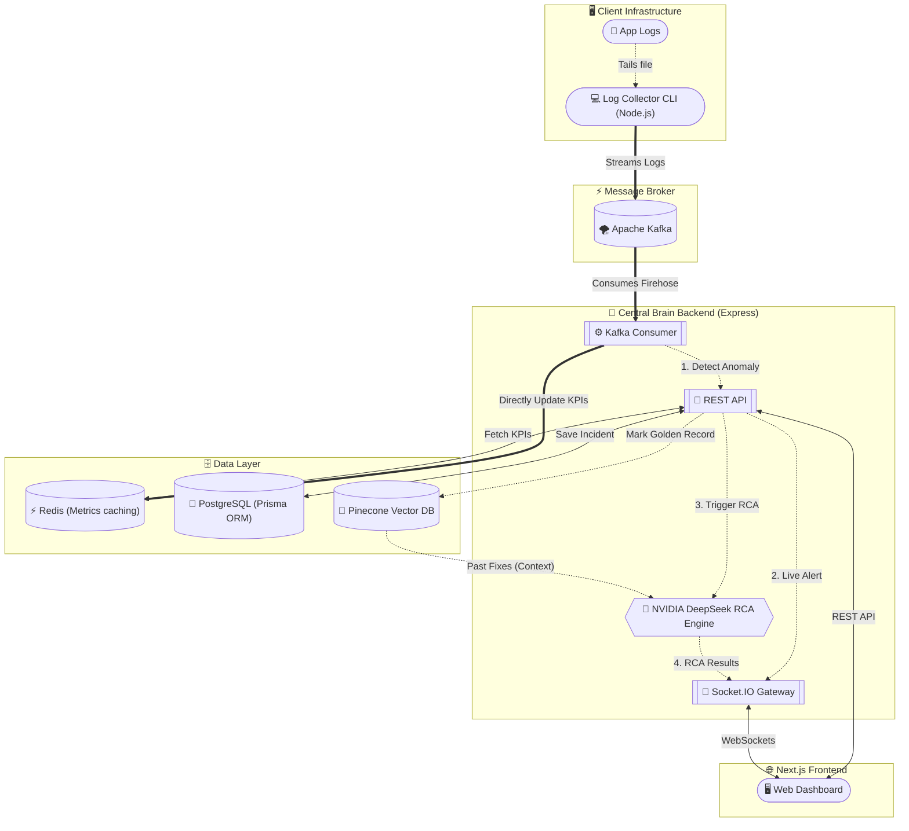
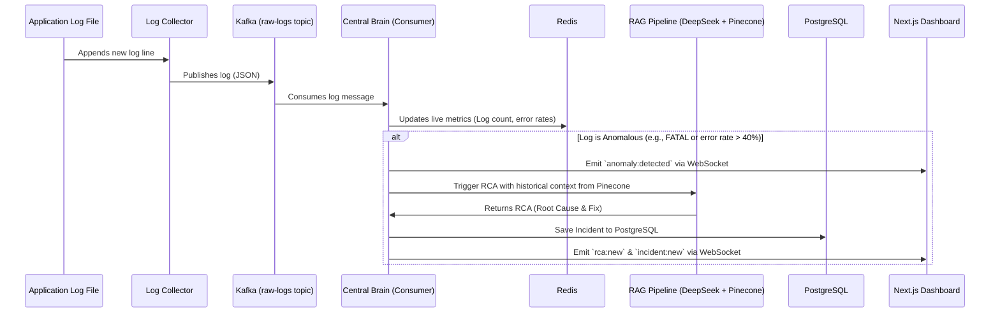

# AI-Ops Sentinel: Comprehensive Project Documentation

## 1. Project Overview
**AI-Ops Sentinel** is a powerful platform built for Site Reliability Engineers (SREs) and DevOps teams. It automatically ingests server logs via Apache Kafka, uses **NVIDIA NIM (DeepSeek-R1)** coupled with a Pinecone Vector Database (RAG) to instantly identify the root cause of crashes, and streams the analysis live to an isolated, multi-tenant Next.js dashboard using WebSockets.

---

## 2. Architecture Diagram

---

## 3. Data Flow Diagram

---

## 4. Codebase Structure & File-by-File Explanation

The project is split into the frontend (`aiops-sentinel-frontend`) and backend (`aiops-sentinel-backend`), with the backend further divided into microservices.

### 4.1 Backend (`aiops-sentinel-backend/services`)

#### 4.1.1 `log-collector` (Log Ingestion Agent)
A lightweight Node.js script that tails a target log file and pushes new lines to Kafka.
* **`src/collector.ts`**: The main script. Contains a `FileTailer` class that polls the log file for new lines efficiently using `fs.promises.stat` and `fs.promises.read`. It strips BOMs and Windows carriage returns, formats the lines into structured `LogMessage` JSON objects (tagging them with a `platformId`), and uses KafkaJS to produce them to the `raw-logs` topic. If Kafka is disabled (`USE_KAFKA=false`), it falls back to a mock sender (console.log).

#### 4.1.2 `log-generator` (Synthetic Data Generator)
Used for local testing to simulate a lively, error-prone microservice architecture.
* **`src/generator.ts`**: Uses `setInterval` to periodically emit fake logs for services like `api-gateway`, `payment-service`, etc. It has built-in probability weights (68% INFO, 22% WARN, 8% ERROR, 2% CRITICAL). Most importantly, it occasionally injects an "error burst" (many CRITICAL errors at once) to intentionally trigger the Central Brain's anomaly detection.

#### 4.1.3 `central-brain` (Express API & Processing Engine)
The core backend service that processes logs, communicates with AI, and serves the frontend.

* **`src/server.ts`**: The entry point. Bootstraps the Express app, configures CORS and Helmet, initializes Socket.IO with JWT authentication, connects to Redis and PostgreSQL, mounts REST API routes, and starts the Kafka consumer.
* **`prisma/schema.prisma`**: The database schema defining `User`, `Incident` (stores RCA results), and `GoldenRecord` (stores historical fixes mapped to Pinecone vectors).
* **`src/services/kafkaConsumer.ts`**: Connects to the Kafka `raw-logs` topic. Processes messages in a sliding window (last 100 logs per source). It increments metrics in Redis concurrently. It calls `detectAnomaly`, and if an anomaly is found, immediately alerts the frontend via WebSocket. It then asynchronously triggers `runRcaPipeline` and saves the resulting RCA and Incident to PostgreSQL.
* **`src/services/anomalyDetector.ts`**: Contains the pure logic for anomaly detection. It matches logs against regex patterns (e.g., `FATAL`, `ECONNREFUSED`, `OutOfMemoryError`) or detects sliding-window error rate spikes (e.g., > 40% errors in the last 20 logs).
* **`src/services/ragPipeline.ts`**: The AI integration layer. When an anomaly is detected, it embeds the log snippet using NVIDIA's `nv-embedqa-e5-v5` model and queries Pinecone for similar past incidents ("Golden Records"). It constructs a prompt with this historical context and queries NVIDIA DeepSeek (`deepseek-v4-flash` or `deepseek-r1`) to generate a JSON response containing the `rootCause`, `suggestedFix`, and `confidence`. It also contains an `ingestResolution` function to save new, human-approved fixes back into Pinecone.
* **`src/sockets/socketHandler.ts`** (Implied by imports): Manages active WebSocket connections. Joins clients to rooms based on their `platformId` to ensure multi-tenant data isolation.

### 4.2 Frontend (`aiops-sentinel-frontend`)

A modern Next.js 15 application utilizing React Server Components, Tailwind CSS, and Socket.IO for real-time reactivity.

* **`src/app/layout.tsx`**: The root layout. Includes global providers (like NextAuth for session management and Socket Context for real-time updates).
* **`src/app/(app)/dashboard`**: The main live dashboard. Subscribes to Redis metric updates and WebSocket events to display live graphs (log volume, error rates) and incoming anomaly alerts instantly.
* **`src/app/(app)/incidents`**: The incident management page. Lists all historical and active incidents saved in PostgreSQL, displaying the AI-generated Root Cause Analysis and allowing SREs to mark them as resolved.
* **`src/app/(app)/analytics`**: Displays long-term trends and metrics querying the Express API.
* **`src/app/(app)/golden-records`**: Allows viewing and managing the "Golden Records" (historical fixes) that are stored in Pinecone and used to provide context to the AI during future incidents.
* **`src/middleware.ts`**: Next.js middleware that enforces authentication on private `/(app)` routes.

---

## 5. Security & Multi-Tenancy

- **Log Isolation**: The Log Collector tags every ingested log with a `PLATFORM_ID`.
- **WebSocket Isolation**: `central-brain` forces WebSocket clients to authenticate with a JWT. The client is placed in a Socket.IO "room" uniquely named after their `platformId`. Incident alerts are only emitted to `io.to(anomaly.platformId)`, guaranteeing Customer A cannot see Customer B's logs.
- **Metric Namespacing**: Redis keys are prefixed with the tenant ID (e.g., `aiops:metrics:tenant_X:total_logs`).

## 6. Infrastructure

- **`docker-compose.prod.yml`**: Defines the local containerized infrastructure needed to run the platform:
  - Zookeeper & Kafka (Confluent cp-kafka)
  - Redis (for metrics and caching)
  - PostgreSQL (Primary transactional store)
  - The Central Brain backend image
  - The Next.js frontend image
  - Nginx (Reverse proxy)
