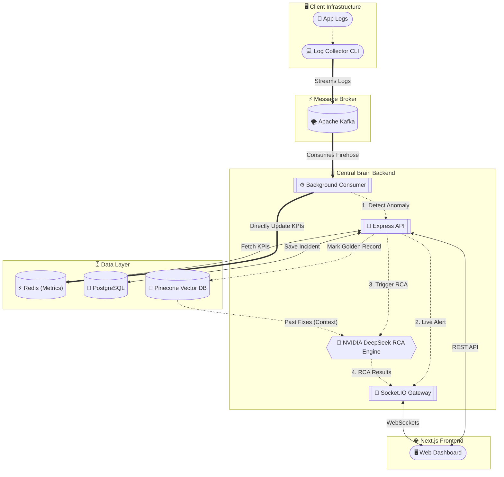

<div align="center">
  
  <h1>AI-Ops Sentinel</h1>
  <p><strong>Intelligent, Multi-Tenant Root Cause Analysis & Real-Time Log Monitoring</strong></p>
  
  <p>
    
    
    
    
    
    
    
  </p>
</div>

---

**AI-Ops Sentinel** is a powerful platform built for Site Reliability Engineers (SREs) and DevOps teams. It automatically ingests server logs via Apache Kafka, uses **NVIDIA NIM (DeepSeek-R1)** coupled with a Pinecone Vector Database (RAG) to instantly identify the root cause of crashes, and streams the analysis live to an isolated, multi-tenant Next.js dashboard using WebSockets.

## ✨ Core Features

* 🚀 **Real-Time Log Ingestion**: Uses Apache Kafka to handle massive throughput of server logs securely.
* 🤖 **AI Root Cause Analysis**: Leverages **NVIDIA NIM (DeepSeek-R1)** via the NVIDIA API to automatically detect anomalies and generate human-readable solutions with chain-of-thought reasoning.
* 📚 **RAG (Retrieval-Augmented Generation)**: Queries Pinecone Vector DB to find "Golden Records" (historical fixes) to solve new problems based on past company knowledge.
* 🔒 **Multi-Tenant Architecture**: Robust tenant isolation using JWT-authenticated WebSockets and Redis key-spacing. Customer A can never see Customer B's logs.
* ⚡ **Live WebSocket Dashboard**: React Context-driven Socket.IO integration for instant incident alerts and live KPI graphs without page refreshes.
* 🧠 **Chain-of-Thought RCA**: DeepSeek-R1's reasoning traces are preserved in the postmortem report, giving SREs full transparency into the AI's diagnostic process.

---

## 🏗️ Architecture



---

## 🚀 Quick Start (Local Development)

To run the entire platform locally, you will need **Docker Desktop**, **Node.js v20+**, and free API keys for **NVIDIA NIM** and **Pinecone**.

### 1. Start Infrastructure
We use Docker Compose to spin up Zookeeper, Kafka, Redis, and PostgreSQL.
```bash
cd aiops-sentinel-backend
docker compose up -d
```
*Wait ~30 seconds for Kafka to become fully healthy.*

### 2. Configure & Start Backend (`central-brain`)
The backend orchestrates the AI, WebSockets, and database.
```bash
cd services/central-brain
cp .env.example .env
npm install
```
Edit `.env` and add your `NVIDIA_API_KEY` and `PINECONE_API_KEY`. (If you don't have keys yet, set `MOCK_AI=true`).

Then, initialize the database and start the server:
```bash
npx prisma migrate deploy
npm run seed
npm run dev
```

### 3. Start Frontend (`aiops-sentinel-frontend`)
```bash
cd ../../../aiops-sentinel-frontend
npm install
npm run dev
```
Open `http://localhost:3000` in your browser. Create an account, or log in with the seeded credentials (`arjun.dev@aiops-sentinel.io` / `SentinelSRE@2026`).

### 4. Stream Test Logs (`log-generator`)
In a new terminal window, simulate an application crash to see the system in action:
```bash
cd aiops-sentinel-backend/services/log-generator
npm install
npm run dev         # Streams synthetic logs + periodic error bursts directly to Kafka
```
Watch your frontend dashboard — the AI will instantly pick up the anomaly, analyze it, and pop up a new Incident Card in real-time!

> **Note:** The log-generator sends one burst of FATAL/CRITICAL errors every 30 seconds to trigger anomaly detection. Set `BURST_INTERVAL_MS=5000` in a local `.env` to trigger bursts more frequently.

---

## 🔐 Multi-Tenant Architecture

Security and data isolation are critical. AI-Ops Sentinel implements multi-tenancy at every layer:
1. **Frontend / Auth:** Users sign up and belong to a specific `platformId`.
2. **Log Collection:** The `log-collector` `.env` requires a `PLATFORM_ID`. All ingested logs are tagged with this ID.
3. **WebSockets:** When the frontend connects, it passes a JWT token. The backend verifies the token and connects the socket to a private `io.to(platformId)` room. Incidents are ONLY broadcasted to the room matching the log's platform ID.
4. **Metrics:** Redis keys are namespaced (e.g., `aiops:metrics:tenant_X:total_logs`).

---

## 🛠️ Environment Variables

### Backend (`aiops-sentinel-backend/services/central-brain/.env`)
| Variable | Required | Description |
|---|---|---|
| `DATABASE_URL` | Yes | PostgreSQL connection string |
| `REDIS_URL` | Yes | Redis connection string |
| `JWT_SECRET` | Yes | Secret for signing JWTs |
| `KAFKA_BROKERS` | Yes | Comma-separated Kafka broker addresses |
| `NVIDIA_API_KEY` | No* | NVIDIA NIM API key (from build.nvidia.com) |
| `NVIDIA_MODEL` | No | NVIDIA NIM model ID (default: `deepseek-ai/deepseek-r1`) |
| `NVIDIA_EMBED_MODEL` | No | NVIDIA NIM embedding model (default: `nvidia/nv-embedqa-e5-v5`) |
| `PINECONE_API_KEY` | No* | Pinecone Vector DB API key |
| `PINECONE_INDEX` | No* | Pinecone index name |
| `MOCK_AI` | No | Set to `true` to skip NVIDIA/Pinecone calls (local dev) |

*Not required when `MOCK_AI=true`.

### Frontend (`aiops-sentinel-frontend/.env.local`)
| Variable | Required | Description |
|---|---|---|
| `NEXTAUTH_SECRET` | Yes | Secret for NextAuth session encryption |
| `NEXTAUTH_URL` | Yes | Public URL of the frontend (e.g., `http://localhost:3000`) |
| `NEXT_PUBLIC_API_URL` | Yes | Backend API base URL (e.g., `http://localhost:4000`) |
| `NEXT_PUBLIC_SOCKET_URL` | Yes | Backend Socket.IO URL (e.g., `http://localhost:4000`) |

### Log Collector (`aiops-sentinel-backend/services/log-collector/.env`)
| Variable | Required | Description |
|---|---|---|
| `KAFKA_BROKERS` | Yes | Comma-separated Kafka broker addresses |
| `PLATFORM_ID` | Yes | Tenant identifier (must match a registered user's platformId) |
| `LOG_FILE_PATH` | Yes | Absolute path to the log file to tail |
| `KAFKA_TOPIC` | No | Kafka topic name (default: `raw-logs`) |
| `USE_KAFKA` | No | Set to `true` to enable Kafka streaming (default: `true`) |
| `POLL_INTERVAL_MS` | No | How often to poll the log file in ms (default: `500`) |

---

## 🔬 Sample Postmortem Report

The following is a realistic example of the postmortem report that Sentinel AI generates when an incident is resolved. This report was produced by the **NVIDIA DeepSeek-R1** RCA engine for incident **INC-500-1024**.

---

### Incident Postmortem — INC-500-1024
**Database Connection Pool Exhausted**

---

#### Incident Summary

| Field | Value |
|---|---|
| **Incident ID** | INC-500-1024 |
| **Title** | Database Connection Pool Exhausted |
| **Severity** | CRITICAL (P1) |
| **Status** | Resolved |
| **Platform** | payment-platform-prod |
| **Service** | payment-service / order-processor |
| **Created** | 2026-06-28 14:51 UTC |
| **Resolved** | 2026-06-28 16:54 UTC |
| **Duration** | 2 hours 3 minutes |
| **Incident Commander** | Arjun Dev (arjun.dev@aiops-sentinel.io) |
| **AI Analysis Engine** | NVIDIA DeepSeek-R1 via NIM |

---

#### Timeline

| Time (UTC) | Event |
|---|---|
| **14:47** | Traffic spike detected — payment-service request rate climbs from 1,200 req/s to 3,800 req/s following a promotional email campaign |
| **14:51** | First FATAL log emitted: `[payment-service] ERROR: Connection acquire timeout after 4800ms — pool exhausted` |
| **14:51** | Sentinel AI ingests the FATAL burst via Kafka consumer; anomaly threshold breached (>10 FATAL logs in 60s) |
| **14:52** | Incident INC-500-1024 auto-created; SRE on-call notified via WebSocket alert on dashboard |
| **14:53** | AI RCA engine triggered; DeepSeek-R1 begins chain-of-thought analysis against 847 log lines and 3 historical Golden Records |
| **14:55** | RCA report streamed to dashboard: root cause identified as `max_pool_size=200` exhausted under 3.8k req/s load |
| **14:58** | Error rate peaks at 62.4%; order-processor begins queuing failed payment retries |
| **15:02** | Cascading failure spreads to downstream `shipping-notification-service` (depends on payment confirmation events) |
| **15:12** | SRE Arjun Dev begins mitigation — raises `max_pool_size` from 200 to 400 on payment-db-primary |
| **15:18** | Connection pool stabilizes; new connections accepted; error rate drops from 62.4% to 18.1% |
| **15:31** | Idle-connection draining enabled (`olderThan: 10s`) to free stale connections faster during future spikes |
| **15:45** | Retry-with-jitter logic deployed to payment-service v2.3.1 via rolling update |
| **16:10** | Circuit breaker configured on payment upstream (`failureThreshold: 5`, `timeout: 30s`) |
| **16:47** | All systems operating nominally; error rate < 0.3% |
| **16:54** | Incident INC-500-1024 marked resolved; postmortem generation triggered |

---

#### Root Cause Analysis

> *The following analysis was generated by NVIDIA DeepSeek-R1 with chain-of-thought reasoning. Reasoning trace preserved for transparency.*

**Primary Root Cause:**

The PostgreSQL connection pool on `payment-db-primary` was configured with `max_pool_size = 200`. Under normal load (1,200 req/s), this was sufficient. The promotional campaign triggered a 3.17x traffic spike to 3,800 req/s. Each incoming payment request requires at least one database connection for the duration of its transaction. With 200 concurrent connections saturated and no connection to acquire, the pool manager began throwing `Connection acquire timeout after 4800ms` errors after exhausting its wait queue.

**Contributing Factors:**

1. **No auto-scaling on connection pool**: The pool limit was a static value set 14 months prior. No alerting existed for pool utilization percentage (e.g., >80% used).
2. **Lack of retry-with-jitter on upstream callers**: When payment-service calls failed, the order-processor retried immediately (no backoff), amplifying the thundering herd and worsening pool exhaustion.
3. **No circuit breaker on payment upstream**: Downstream services (shipping-notification-service) continued hammering payment-service endpoints even as error rates climbed, preventing self-healing.
4. **Stale idle connections held slots**: Long-lived idle connections (some >20 minutes) held pool slots without performing work. Enabling idle-connection draining would have freed capacity.

**Log Evidence (representative sample):**
```
[2026-06-28T14:51:02Z] FATAL payment-service — DB: Connection acquire timeout after 4800ms (pool size: 200/200)
[2026-06-28T14:51:03Z] FATAL payment-service — DB: Connection acquire timeout after 4800ms (pool size: 200/200)
[2026-06-28T14:51:04Z] ERROR order-processor — Payment upstream returned 500; retrying immediately (attempt 1/3)
[2026-06-28T14:51:04Z] ERROR order-processor — Payment upstream returned 500; retrying immediately (attempt 2/3)
[2026-06-28T14:51:05Z] FATAL payment-service — DB: Connection acquire timeout after 4800ms (pool size: 200/200)
[2026-06-28T14:51:06Z] CRITICAL payment-service — Error rate 62.4% — threshold breached (limit: 5%)
```

**Golden Record Match:** Sentinel AI matched this incident against **Golden Record GR-0042** ("DB pool exhaustion under traffic burst — payment-service — 2025-11-15") with a cosine similarity score of **0.94**. The historical fix (pool resize + jitter) was incorporated into the recommendations below.

---

#### Impact

| Metric | Value |
|---|---|
| **Impacted Users** | 14,300 |
| **Peak Error Rate** | 62.4% |
| **Failed Transactions** | ~8,700 payment requests dropped or timed out |
| **Revenue at Risk** | Estimated $43,500 (at average transaction value) |
| **Downstream Services Affected** | shipping-notification-service, analytics-pipeline |
| **SLO Breach** | Yes — availability SLO (99.9%) breached for 123 minutes |

---

#### Resolution Steps (Applied)

The following steps were applied by the SRE team during the incident:

1. **Raise `max_pool_size` from 200 to 400** on `payment-db-primary`
   ```sql
   -- Applied to pgbouncer pool config (payment-db-primary)
   -- pool_size = 400
   -- Applied via: kubectl edit configmap pgbouncer-config -n payments
   ```
   *Impact: Immediate — connection timeouts dropped within 6 minutes.*

2. **Enable idle-connection draining (`olderThan: 10s`)**
   ```javascript
   // knexfile.js — payment-service
   pool: {
     min: 10,
     max: 400,
     idleTimeoutMillis: 10000,   // drain connections idle >10s
     acquireTimeoutMillis: 5000
   }
   ```
   *Impact: Freed ~47 stale connections within 2 minutes of deployment.*

3. **Add retry-with-jitter on upstream calls (order-processor)**
   ```javascript
   // utils/retry.js
   async function retryWithJitter(fn, maxAttempts = 3) {
     for (let attempt = 1; attempt <= maxAttempts; attempt++) {
       try {
         return await fn();
       } catch (err) {
         if (attempt === maxAttempts) throw err;
         const jitter = Math.random() * 1000; // 0–1000ms
         const delay = Math.pow(2, attempt) * 200 + jitter;
         await new Promise(r => setTimeout(r, delay));
       }
     }
   }
   ```
   *Impact: Eliminated thundering-herd retry amplification.*

4. **Configure circuit breaker on payment upstream**
   ```javascript
   // circuitBreaker.js — order-processor
   const breaker = new CircuitBreaker(callPaymentService, {
     failureThreshold: 5,
     successThreshold: 2,
     timeout: 30000,      // open circuit after 30s
     resetTimeout: 60000  // half-open after 60s
   });
   ```
   *Impact: Downstream services now shed load gracefully during payment-service degradation.*

---

#### Action Items

- [ ] **[P0 — Due: 2026-07-05]** Add Prometheus alert for DB pool utilization >75% (`db_pool_used / db_pool_max > 0.75`) — Owner: Platform Team
- [ ] **[P0 — Due: 2026-07-05]** Set `max_pool_size` via environment variable (not hard-coded) across all services — Owner: payment-service squad
- [ ] **[P1 — Due: 2026-07-12]** Implement load-shedding / graceful degradation in payment-service (return cached "processing" response instead of 500 during overload) — Owner: payment-service squad
- [ ] **[P1 — Due: 2026-07-12]** Add horizontal pod autoscaling (HPA) for payment-service based on custom metric `payment_request_queue_depth` — Owner: Platform Team
- [ ] **[P2 — Due: 2026-07-19]** Run quarterly load test at 5x normal traffic to validate all pools, queues, and circuit breakers before peak campaigns — Owner: SRE Guild
- [ ] **[P2 — Due: 2026-07-19]** Document pool sizing formula in runbook: `max_pool_size = (peak_rps * avg_query_duration_ms) / 1000 * 1.25` — Owner: Arjun Dev
- [ ] **[P3 — Done]** Mark this incident as a Golden Record in Pinecone for future RCA matching — Owner: Sentinel AI (automatic)

---

#### Prevention

To prevent recurrence, the following systemic changes are recommended:

**Operational:**
- Pool utilization dashboards added to the SRE Sentinel dashboard under "Infrastructure KPIs"
- Pre-campaign checklist updated: SRE must verify pool headroom >50% before major marketing sends
- Runbook updated with pool-exhaustion diagnosis steps (check pgbouncer stats, identify stale connections, emergency pool resize)

**Architectural:**
- All services must implement `retry-with-jitter` for any inter-service call (enforced at code review)
- Circuit breakers are now mandatory for any synchronous downstream dependency (enforced via architecture review board)
- Connection pool limits must be driven by environment variables with sensible defaults validated at service startup

**Monitoring:**
- New alert: `payment_db_pool_utilization > 75%` → PagerDuty P2
- New alert: `payment_db_pool_utilization > 90%` → PagerDuty P1 (auto-creates Sentinel incident)
- New dashboard panel: "DB Pool Health" showing utilization % over time per service

---

*Postmortem generated by AI-Ops Sentinel v1.0 powered by NVIDIA DeepSeek-R1 — 2026-06-28 16:55 UTC*
*Review and sign off: Arjun Dev — 2026-06-28 17:10 UTC*

---

## 📄 License

This project is licensed under the MIT License.
